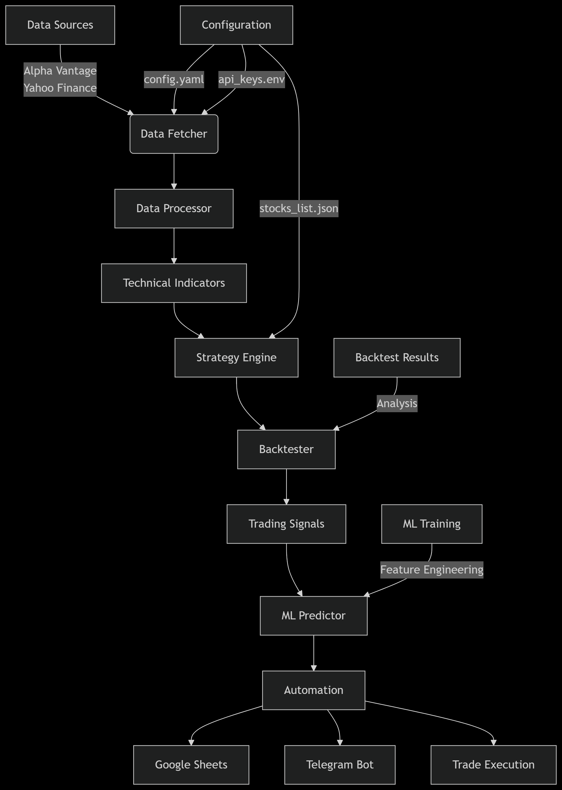

# Algorithmic Trading System - NIFTY 50 Stocks

[](https://www.python.org/)
[](https://opensource.org/licenses/MIT)
[](docs/)
[](tests/)

An automated trading system that implements technical analysis and machine learning strategies on NIFTY 50 stocks. The system features real-time data processing, backtesting, automated trade execution, and integration with Google Sheets for reporting.

##  Demo Videos
- [Algorithmic Trading System Explained](https://youtu.be/_NenH9Vqpvk)
- [Live Trading & Google Sheets Integration](https://youtube.com/demo_video_2)
##  Project Structure
```
algo-trading-assignment/
│
├── 📁 src/                          # Main source code
│   ├── 📁 data/                     # Data handling modules
│   │   ├── __init__.py
│   │   ├── data_fetcher.py          # API connections & data fetching
│   │   ├── data_processor.py        # Data cleaning & preprocessing
│   │   └── indicators.py            # Technical indicators (RSI, MA, MACD)
│   │
│   ├── 📁 strategy/                 # Trading strategy logic
│   │   ├── __init__.py
│   │   ├── base_strategy.py         # Abstract base strategy class
│   │   ├── rsi_ma_strategy.py       # RSI + Moving Average strategy
│   │   └── backtester.py            # Backtesting engine
│   │
│   ├── 📁 ml/                       # Machine Learning components
│   │   ├── __init__.py
│   │   ├── feature_engineer.py      # Feature creation & selection
│   │   ├── model_trainer.py         # ML model training
│   │   └── predictor.py             # Prediction engine
│   │
│   ├── 📁 automation/               # Automation & integration
│   │   ├── __init__.py
│   │   ├── sheets_manager.py        # Google Sheets operations
│   │   ├── telegram_bot.py          # Telegram notifications (bonus)
│   │   └── scheduler.py             # Task scheduling
│   │
│   └── 📁 utils/                    # Utility functions
│       ├── __init__.py
│       ├── logger.py                # Logging configuration
│       ├── config.py                # Configuration management
│       └── helpers.py               # Common helper functions
│
├── 📁 config/                       # Configuration files
│   ├── config.yaml                  # Main configuration
│   ├── api_keys.env.example         # Environment variables template
│   └── stocks_list.json             # NIFTY 50 stocks configuration
│
├── 📁 data/                         # Data storage
│   ├── raw/                         # Raw data from APIs
│   ├── processed/                   # Cleaned/processed data
│   └── backtest_results/            # Backtesting outputs
│
├── 📁 models/                       # Saved ML models
│   ├── decision_tree_model.pkl
│   └── model_metrics.json
│
├── 📁 logs/                         # Log files
│   ├── trading.log
│   ├── errors.log
│   └── api_calls.log
│
├── 📁 notebooks/                    # Jupyter notebooks (optional)
│   ├── data_exploration.ipynb
│   ├── strategy_analysis.ipynb
│   └── ml_model_development.ipynb
│
├── 📁 tests/                        # Unit tests
│   ├── __init__.py
│   ├── test_data_fetcher.py
│   ├── test_strategy.py
│   └── test_ml_model.py
│
├── 📁 docs/                         # Documentation
│   ├── setup_guide.md
│   ├── api_documentation.md
│   └── strategy_explanation.md
│
│
├── main.py                          # Main execution script
├── requirements.txt                 # Python dependencies
├── README.md                                           
└── .gitignore                       # Git ignore rules                    
```
##  System Architecture

##  Key Features
- **Multi-source Data Integration**: Real-time and historical data from Alpha Vantage and Yahoo Finance
- **Technical Indicators**: RSI, Moving Averages, MACD, Bollinger Bands
- **Strategy Engine**: Customizable trading strategies with rule-based logic
- **Backtesting Framework**: Historical strategy performance evaluation
- **Machine Learning Integration**: Predictive models for trade signal enhancement
- **Automation**: Scheduled execution and reporting
- **Google Sheets Integration**: Real-time trade logging and performance tracking
- **Telegram Notifications**: Instant alerts for trade signals and system events

## ⚙ System Requirements
- Python 3.9+
- 8GB RAM (recommended)
- 1GB free disk space
- Google Cloud Platform account (for Sheets API)
- Alpha Vantage API key (free tier available)

##  Installation
```bash
# Clone repository
git clone https://github.com/fa-code2/algo-trading-ml-assignment
cd algo-trading-assignment

# Create virtual environment
python -m venv trading-env
source trading-env/bin/activate  # Linux/Mac
trading-env\Scripts\activate    # Windows

# Install dependencies
pip install -r requirements.txt
```

##  Configuration
1. **Set up configuration files**:
   ```bash
   cp config/config.yaml.example config/config.yaml
   cp config/api_keys.env.example config/api_keys.env
   ```
   
2. **Edit configuration files**:
   - `config/config.yaml`: Add your Google Sheet URL and trading parameters
   - `config/api_keys.env`: Add your Alpha Vantage API key and Telegram bot token

3. **Google Sheets API Setup**:
   - Enable Google Sheets API in [Google Cloud Console](https://console.cloud.google.com/)
   - Download credentials JSON file and save as `config/credentials.json`


## Expected Output
```
=============================================================
TRADING SYSTEM EXECUTION SUMMARY
=============================================================

 Data Fetched for 3 stocks:
   • RELIANCE.NS
   • TCS.NS
   • INFY.NS

 Backtest Results:
   • RELIANCE.NS: 12.34% return, 65.2% win rate
   • TCS.NS: 8.76% return, 58.1% win rate
   • INFY.NS: 15.23% return, 71.4% win rate

 ML Predictions (Accuracy):
   • RELIANCE.NS: 67.8%
   • TCS.NS: 62.3%
   • INFY.NS: 69.1%

 Current Signals:
   • RELIANCE.NS: BUY at ₹2,456.75
   • TCS.NS: No active signals

 Google Sheets updated with all results
=================================
```
##  Running the System

### Backtesting a Strategy
```bash
python main.py --mode backtest --strategy rsi_ma --symbols TCS,INFY --from 2023-01-01 --to 2023-12-31
```

### Live Trading Mode
```bash
python main.py --mode live --strategy ml_enhanced --symbols NIFTY50
```

### Generate Trading Signals
```bash
python main.py --mode signals --strategy rsi_ma --symbols RELIANCE
```

### Command Line Options
| Option         | Description                           | Default        |
|----------------|---------------------------------------|----------------|
| `--mode`       | Operation mode (backtest, live, etc.) | `backtest`     |
| `--strategy`   | Trading strategy to use               | `rsi_ma`       |
| `--symbols`    | Comma-separated stock symbols         | `NIFTY50`      |
| `--from`       | Start date (YYYY-MM-DD)               | 30 days ago    |
| `--to`         | End date (YYYY-MM-DD)                 | Current date   |
| `--output`     | Output format (console, gsheets)      | `console`      |


##  Machine Learning Pipeline
1. **Feature Engineering**:
   - Technical indicators (RSI, MACD, Bollinger Bands)
   - Price derivatives
   - Volume analysis
   - Statistical features


##  Google Sheets Integration
The system automatically logs all trades to Google Sheets with the following structure:

| Timestamp       | Symbol | Action | Price | Quantity | Strategy | Confidence | Indicators       |
|-----------------|--------|--------|-------|----------|----------|------------|------------------|
| 2023-08-04 10:25| TCS.NS    | BUY    | 3450  | 10       | ML       | 0.87       | RSI=28, MA_CROSS |
| 2023-08-04 14:30| RELIANCE.NS   | SELL   | 1450  | 15       | RSI_MA   | -          | RSI=72, MA_CROSS |

##  Testing
Run the test suite with:
```bash

#Run Test to check Full System
python test_system.py

```

Test Coverage:
- Data fetching and processing
- Indicator calculations
- Strategy logic
- Backtesting engine
- Google Sheets integration


##  Security Practices
- Sensitive configuration excluded via `.gitignore`
- API keys stored in environment variables
- Encrypted credentials handling
- Pre-commit hooks for secret detection
- Limited permission Google Cloud credentials

##  Contributing
1. Fork the repository
2. Create a feature branch (`git checkout -b feature/your-feature`)
3. Commit your changes (`git commit -am 'Add some feature'`)
4. Push to the branch (`git push origin feature/your-feature`)
5. Open a pull request

 ## Acknowledgments
This algorithmic trading system was developed as part of a 2nd round internship test assignment by **H TO H**. We acknowledge their comprehensive requirements and evaluation criteria that guided the development of this full-featured trading platform.
**Special thanks to:**

H TO H for providing the internship opportunity and detailed project specifications
The evaluation team for setting challenging requirements that pushed for a robust solution
The open-source community for the excellent libraries that made this system possible
Financial data providers for making market data accessible for testing and development


## Disclaimer
This software is for educational and research purposes only. Trading stocks involves risk, and past performance does not guarantee future results. The authors are not responsible for any financial losses incurred through the use of this software. Always consult with a financial advisor before making investment decisions.   
   

##  License
This project is licensed under the MIT License - see the [LICENSE](LICENSE) file for details.

##  Contact
For inquiries or support:
- Email: faaa367810@gmail.com
- LinkedIn: [linkedin.com/in/fa-aslam/](https://www.linkedin.com/in/fa-aslam/)
